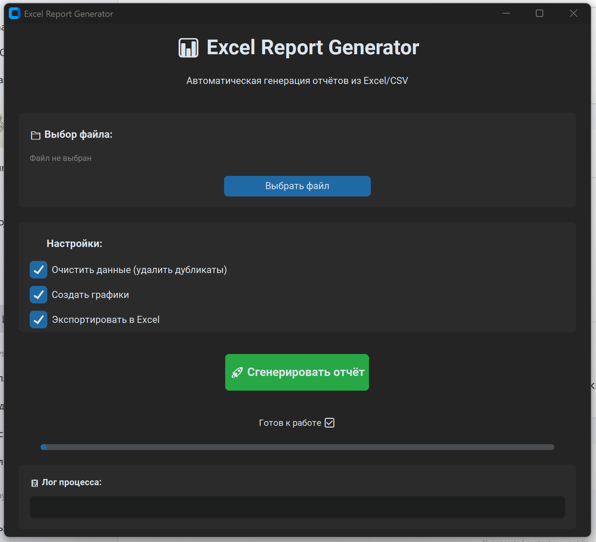
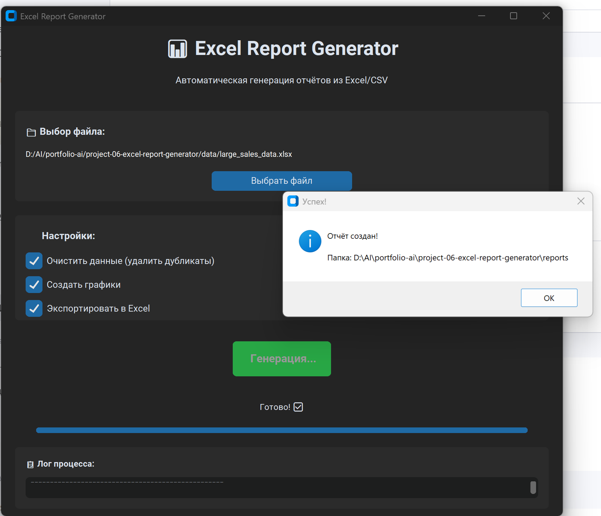
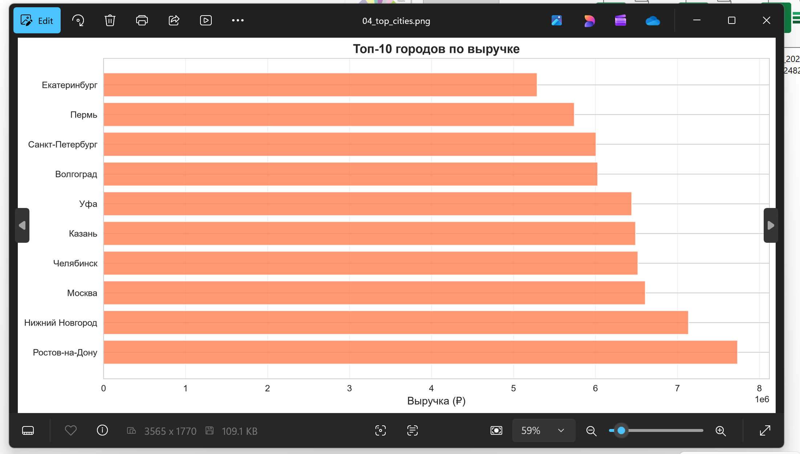

# 📊 Excel Report Generator

Автоматический генератор профессиональных отчётов из Excel/CSV данных. Анализирует, визуализирует и создаёт красивые отчёты.

## 📸 Скриншоты

### Главный интерфейс


### Процесс генерации


### Примеры графиков


##  Примеры отчётов

### Что включает отчёт:

**📊 Статистика:**
- Сумма, среднее, медиана
- Мин/макс значения
- Стандартное отклонение
- Процентили (25%, 75%)

**📈 Визуализации:**
- Динамика продаж по дням
- Топ-10 товаров/категорий
- Распределение по городам
- Гистограмма распределения чеков

**📑 Excel отчёт (5 листов):**
1. Исходные данные
2. Сводная статистика
3. Анализ по категориям
4. Анализ по городам
5. Анализ по менеджерам


##  Возможности

- ✅ **Загрузка данных** — CSV, Excel файлы
- ✅ **Очистка данных** — удаление дубликатов, обработка пропусков
- ✅ **Анализ** — статистика, группировки, сводные таблицы
- ✅ **Визуализация** — графики, диаграммы, heatmaps
- ✅ **Экспорт отчётов** — Excel с форматированием, HTML, PDF
- ✅ **GUI интерфейс** — удобный выбор файлов и настроек
- ✅ **Шаблоны отчётов** — готовые конфигурации для разных задач

## 📋 Что внутри

### Технологии
- **Pandas** — обработка и анализ данных
- **OpenPyXL** — работа с Excel (форматирование, формулы)
- **Matplotlib + Seaborn** — визуализация данных
- **Jinja2** — HTML-шаблоны для отчётов
- **CustomTkinter** — современный GUI

### Типы отчётов

**1. Продажи:**
- Общая выручка, средний чек
- Динамика продаж по дням/месяцам
- Топ товаров/услуг
- География продаж

**2. Финансы:**
- Доходы/расходы
- Прибыль по категориям
- Прогнозирование
- Cash flow

**3. Маркетинг:**
- Конверсия воронок
- ROI кампаний
- Источники трафика
- CAC/LTV метрики

**4. HR:**
- Текучесть кадров
- Производительность
- Отпуска/больничные
- Зарплатная ведомость

## 🚀 Быстрый старт

### 1. Установи зависимости

```bash
pip install -r requirements.txt